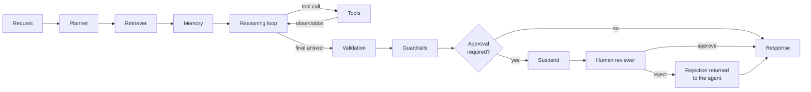
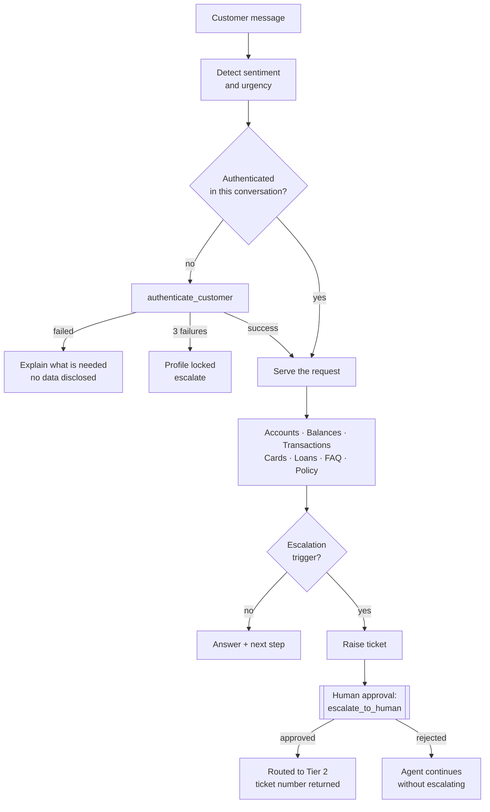
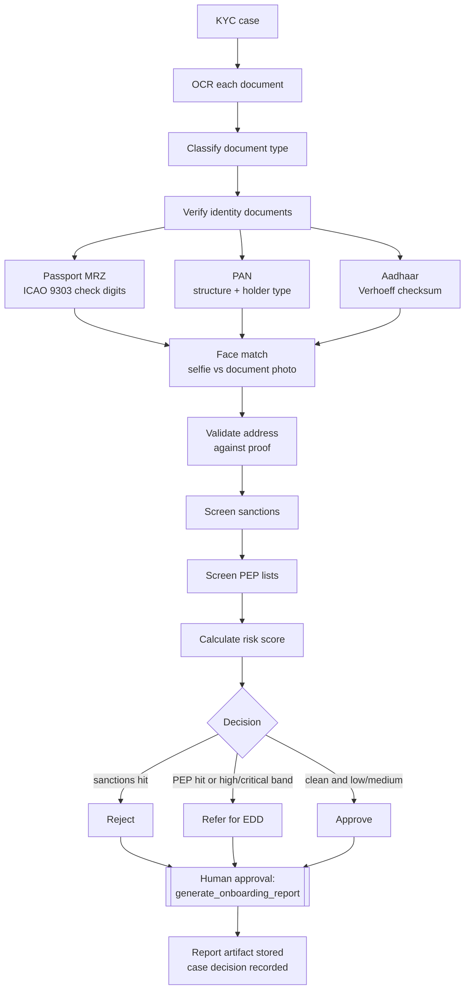
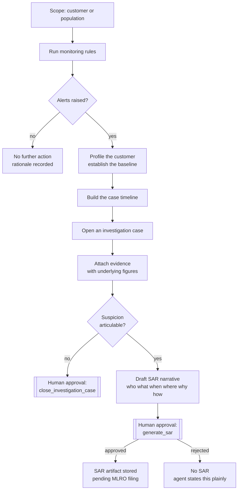
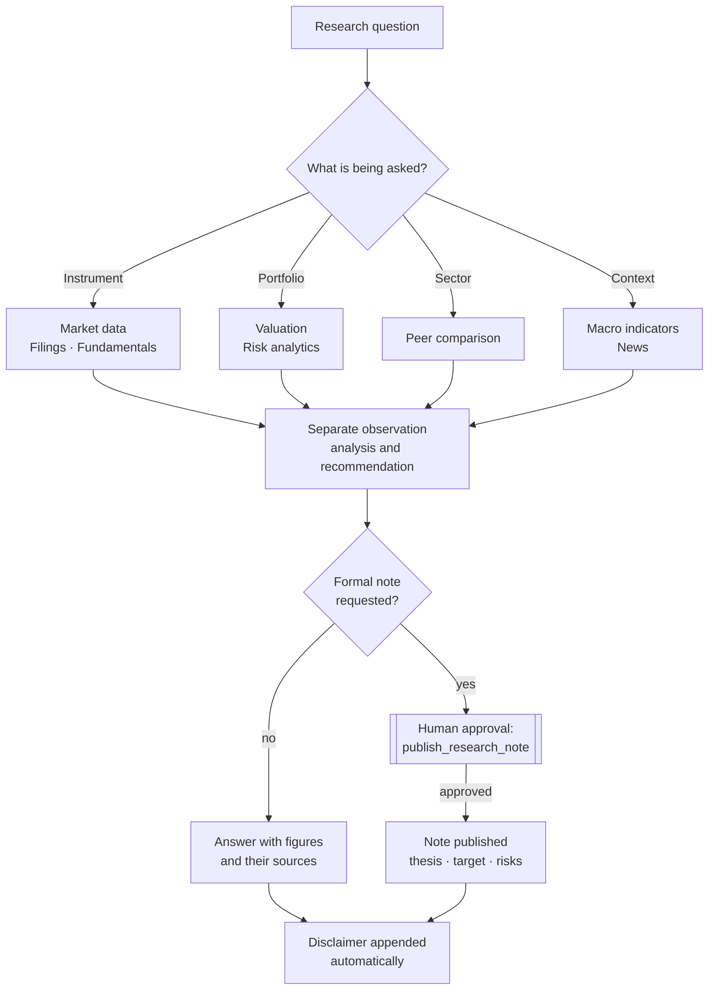
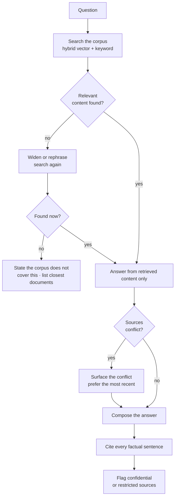

# Agent processes

What each agent does, in what order, where a human has to intervene, and what comes out
the other end. Written for the people who own the process — operations, compliance and
risk — not only for engineers.

- [How every agent runs](#how-every-agent-runs)
- [Customer Service](#1-customer-service-agent)
- [KYC & Customer Onboarding](#2-kyc--customer-onboarding-agent)
- [AML Fraud Investigation](#3-aml-fraud-investigation-agent)
- [Investment Research](#4-investment-research-agent)
- [Internal Knowledge Assistant](#5-internal-knowledge-assistant)
- [Cross-agent summary](#cross-agent-summary)

---

## How every agent runs

All five agents execute the same graph. Nothing is agent-specific about tracing, budgets,
guardrails, approvals or audit — an agent author cannot opt out of them.

| Stage | What happens | Why it matters to the business |
|---|---|---|
| **Planner** | The model writes a plan: objective, steps, tools it expects to need, risk level | The declared risk level drives whether a human is asked to sign off |
| **Retriever** | Hybrid vector + keyword search over the agent's knowledge sources | Policy answers come from your documents, not the model's training data |
| **Memory** | Loads the conversation thread where the agent is conversational | A customer does not have to repeat themselves |
| **Reasoning loop** | The model decides, tools execute, results feed back — up to the agent's iteration cap | Every factual claim traces to a tool result |
| **Tools** | Schema-validated calls against systems of record, with timeout, retry and health tracking | A failing downstream system degrades one capability, not the platform |
| **Validation** | Non-empty answer, tool success, citation presence, groundedness overlap | Catches an answer that looks complete but is not supported |
| **Guardrails** | PII masking, blocked terms, prompt-injection detection, mandated disclaimers | Nothing leaves the platform unmasked or without its legal wrapper |
| **Human approval** | Suspends the run, holds state, waits for a reviewer | Consequential actions stay with a named person |
| **Response** | Finalises the answer, citations, artifacts and memory | The record of what was decided and on what basis |

**Three properties hold for every run, on every agent:**

1. **Everything is traced.** Each stage writes a span with timings, inputs, outputs, tokens
   and cost. An auditor can reconstruct any decision months later.
2. **A suspended run is not a lost run.** When an approval gate fires, the full state is
   checkpointed. The reviewer may take a minute or a day; the agent resumes exactly where
   it stopped.
3. **A rejection is an answer, not a crash.** When a reviewer says no, the agent is told
   and responds accordingly. It does not claim the action happened.

---

## 1. Customer Service Agent

**Purpose** — resolve retail banking queries end to end: balances, transactions, cards,
loans, product policy — and know when to hand over to a person.

**Triggered by** a customer message through the console, the API or a channel integration.
**Inputs:** the message, plus an identifier (customer number, email or phone) and a
telephone-banking PIN or security answer. Conversations carry a thread id.

### Workflow

### The process in steps

| # | Step | Tool | Produces |
|---|---|---|---|
| 1 | Read the customer's tone and urgency | `detect_sentiment` | Sentiment label, urgency, escalation recommendation |
| 2 | Verify identity before anything else | `authenticate_customer` | Authenticated session scoped to this execution |
| 3 | Find what the customer holds | `lookup_customer_accounts` | Account list with type, status, branch |
| 4 | Answer the question | `get_account_balance`, `get_recent_transactions`, `get_credit_card_details`, `get_loan_details` | Figures read from the ledger, account and card numbers masked |
| 5 | Cover policy and product questions | `search_faq`, `search_knowledge_base` | Answers from the FAQ and policy corpus |
| 6 | Record follow-up work | `create_support_ticket` | Ticket number, assigned team, SLA due time |
| 7 | Hand over to a person when required | `escalate_to_human` **(approval gate)** | Escalated ticket routed to the Tier 2 desk |

### Decision rules

- **No disclosure before authentication.** Account, card, loan and transaction tools all
  refuse until `authenticate_customer` has succeeded *in that execution*. This is enforced
  in the tools, not only requested in the prompt.
- **Three strikes.** After three failed attempts the profile locks and the agent escalates
  rather than continuing to probe.
- **Escalate when** the customer alleges fraud or an unauthorised transaction, asks for a
  complaint or mentions the Ombudsman, is identified as vulnerable, or sentiment falls
  below −0.6.
- **Never repeat a full card, account, PAN or Aadhaar number.** Tools return masked values;
  the guardrail stage masks anything that slips through.

### Outputs

A customer-facing answer, any ticket numbers created, and a memory thread so the next
contact has context. Typical run: **under 25 seconds, capped at $1.00.**

---

## 2. KYC & Customer Onboarding Agent

**Purpose** — perform customer due diligence to RBI/FATF standards and produce a
defensible onboarding recommendation.

**Triggered by** a new onboarding case. **Inputs:** the case number, plus declared
occupation, income and expected volumes where available. Documents are uploaded to the
case beforehand.

### Workflow

### The process in steps

| # | Step | Tool | Produces |
|---|---|---|---|
| 1 | Read each uploaded document | `ocr_document` | Extracted text, engine used |
| 2 | Establish what each document is | `classify_document` | Document type with confidence |
| 3 | Validate the passport | `verify_passport` | MRZ fields, four check-digit results, expiry, name match |
| 4 | Validate the PAN | `verify_pan` | Structure result, holder type, surname-initial cross-check |
| 5 | Validate the Aadhaar | `verify_aadhaar` | Checksum result; **only the last four digits are ever stored** |
| 6 | Confirm the applicant is the document holder | `face_match` | Similarity score against a 0.75 threshold |
| 7 | Confirm the declared address | `validate_address` | Token coverage, postcode match, document date |
| 8 | Screen for sanctions | `screen_sanctions` | Matches with list, programme, score |
| 9 | Screen for political exposure | `screen_pep` | PEP matches with position and tier |
| 10 | Score the relationship | `calculate_kyc_risk_score` | Weighted score, band, recommended action |
| 11 | Record the decision | `generate_onboarding_report` **(approval gate)** | Stored report artifact, case status |

### Decision rules

| Finding | Outcome |
|---|---|
| Confirmed sanctions match | **Reject.** Automatic, no discretion |
| PEP match | **Refer** for enhanced due diligence — never straight-through approved |
| Risk band high or critical | **Refer** — senior compliance sign-off required |
| Failed document check, or face match below 0.75 | **Refer** at best |
| Clean, low or medium band, all checks pass | **Approve** with standard due diligence |

The risk model weights sanctions hits (60), PEP exposure (25), geography (20), biometric
mismatch (18), occupation (15), each failed document (12) and unverified address (8),
capped at 100. Calibrate these against your own model — see
[`BANKING_CONFIGURATION.md`](BANKING_CONFIGURATION.md).

### Outputs

A stored onboarding report containing every check, the value observed, the threshold
applied and the rationale, plus the case decision. The report is the audit artifact and is
exempt from routine retention purge. Typical run: **up to 3 minutes, capped at $3.00.**

> The final report always requires human approval, at medium risk and above. The agent
> recommends; a named compliance officer decides.

---

## 3. AML Fraud Investigation Agent

**Purpose** — detect financial-crime typologies in transaction activity, build an
evidenced case, and draft a regulator-ready SAR for the MLRO.

**Triggered by** the hourly monitoring job, an analyst request, or an alert escalation.
**Inputs:** an instruction, optionally a customer id and a lookback window.

### Workflow

### The process in steps

| # | Step | Tool | Produces |
|---|---|---|---|
| 1 | Run the rule set over the ledger | `monitor_transactions` | Alerts by typology with amounts, counts and transaction references |
| 2 | Establish expected behaviour | `profile_customer` | Volumes, channels, counterparties, geography, statistical baseline |
| 3 | Place events in sequence | `build_case_timeline` | Chronological transactions and alerts |
| 4 | Open the case | `create_investigation_case` | Case number, linked alerts, typologies, risk score |
| 5 | Record each finding | `attach_case_evidence` | Evidence items with figures, appended to the case timeline |
| 6 | Check the subject against lists | `screen_sanctions`, `screen_pep` | Watchlist context for the narrative |
| 7 | Draft the filing | `generate_sar` **(approval gate)** | SAR artifact with narrative and supporting transactions |
| 8 | Dispose of the case | `close_investigation_case` **(approval gate)** | Disposition and rationale |

### The monitoring rules

| Code | Typology | Severity |
|---|---|---|
| R001 | Structuring — repeated amounts just below the reporting threshold, same day | High |
| R002 | Rapid movement of funds — 80%+ of a large credit leaves within 48 hours | High |
| R003 | High-risk jurisdiction exposure | High |
| R004 | Round-value layering — three or more round transfers | Medium |
| R005 | Velocity spike — 4× or more against the trailing baseline | Medium |
| R006 | Dormant reactivation — 120+ days idle, then high value | Medium |
| R007 | Counterparty concentration — one party above 70% of volume | Low |

### Decision rules

- **Observation is separated from inference.** The agent describes activity inconsistent
  with the known profile; it never asserts criminality.
- **Everything is quantified.** Amounts, dates, references and counterparties come from
  the ledger and appear in the narrative.
- **No suspicion, no SAR.** Where the evidence does not support a filing, the agent says so
  and records a no-further-action disposition with reasoning.
- **Tipping off is a criminal offence.** Every output carries the internal-use disclaimer
  and is never customer-facing.

### Outputs

An investigation case with timeline and evidence, and where warranted a stored SAR
artifact in `pending_approval` status. Typical run: **up to 5 minutes, capped at $4.00.**

> Both the SAR draft and case closure require human approval. The MLRO or a delegated
> deputy is the only person who files.

---

## 4. Investment Research Agent

**Purpose** — produce evidence-based research and portfolio analytics for the wealth
division.

**Triggered by** an adviser or analyst request. **Inputs:** the research question, plus a
ticker or portfolio code where relevant.

### Workflow

### The process in steps

| # | Step | Tool | Produces |
|---|---|---|---|
| 1 | Establish price behaviour | `get_market_data` | History, return, volatility, drawdown, moving averages, 52-week range |
| 2 | Read the filings | `get_company_filings` | Recent SEC filings with direct links |
| 3 | Analyse the statements | `analyse_financial_statements` | Profitability, growth, leverage, valuation ratios, risk flags |
| 4 | Value the portfolio | `analyse_portfolio` | Market value, P&L, weights, sector and asset-class allocation, concentration |
| 5 | Measure the risk | `analyse_portfolio_risk` | Historical VaR, expected shortfall, annualised volatility, beta |
| 6 | Compare the peer set | `compare_sector` | Ranked return and volatility across constituents |
| 7 | Add context | `get_macro_indicators`, `get_market_news` | Macro series, recent headlines |
| 8 | Publish | `publish_research_note` **(approval gate)** | Stored note with thesis, target, catalysts, risks, citations |

### Decision rules

- **Facts before opinion.** Tools run first; the numbers relied on appear in the answer
  with their source field.
- **Every recommendation carries** a thesis, a valuation anchor, catalysts, **at least two
  downside risks**, and a time horizon. A note without documented risks is rejected by the
  tool itself.
- **Gaps are stated.** Where a data source is unavailable, the agent says so and explains
  how it limits the conclusion, rather than filling the gap.
- **The disclaimer is not optional.** The guardrail stage appends it to every response:
  information only, not advice, capital at risk.

### Outputs

An analysis with its underlying figures, and where requested a published research note.
Typical run: **up to 3 minutes, capped at $3.00.**

> Publishing a note requires human approval. A named analyst signs off before anything
> reaches a client.

---

## 5. Internal Knowledge Assistant

**Purpose** — answer employee questions from the enterprise corpus, with citations, and
refuse when the answer is not there.

**Triggered by** an employee question in the console or a channel integration.
**Inputs:** the question, optionally a restriction to specific sources, and a thread id.

### Workflow

### The process in steps

| # | Step | Tool | Produces |
|---|---|---|---|
| 1 | Search the corpus | `search_knowledge_base` | Ranked chunks with vector and keyword scores, plus citations |
| 2 | Check what is connected | `list_knowledge_sources` | Sources, sync status, document and chunk counts |
| 3 | Read a document in full | `fetch_document` | Full text with author and classification |
| 4 | Condense long material | `summarise_document` | Executive, technical or bullet summary |
| 5 | Report coverage | `knowledge_base_stats` | Corpus size and embedding coverage |

Sources: engineering architecture docs, banking policies, compliance policies, runbooks,
meeting notes and the product catalogue — extended through the Confluence, SharePoint,
Jira, Slack, Teams, GitHub, SQL and S3 connectors.

### Decision rules

- **Search before answering, always.** If the first pass is thin, rephrase and search again.
- **Answer only from what was retrieved.** General knowledge is not an acceptable source.
- **Cite every factual sentence.** The validation stage fails an uncited answer even when
  the content is correct.
- **Say when the corpus is silent.** List the closest documents found and who owns them.
  This is the behaviour most likely to erode trust if it fails, so the conformance suite
  tests it explicitly.
- **Flag classification.** When an answer draws on confidential or restricted documents,
  the reader is told.

### Outputs

A cited answer with a Sources list, and a memory thread for follow-up questions. Typical
run: **under 45 seconds, capped at $1.50.**

> No approval gate — the agent only reads. Its discipline is citation, not sign-off.

---

## Cross-agent summary

### Where a human decides

| Agent | Gate | Who | Why |
|---|---|---|---|
| Customer Service | `escalate_to_human` | Approver | Commits a specialist team and changes the customer's service path |
| KYC & Onboarding | Final report and decision (medium risk and above) | Approver | A regulated onboarding decision |
| AML Investigation | `generate_sar`, `close_investigation_case` (medium risk and above) | Approver / MLRO | A regulatory filing and its disposition |
| Investment Research | `publish_research_note` | Approver | Client-facing material |
| Knowledge Assistant | — | — | Read-only |

Segregation of duties is enforced: the requester cannot approve their own request, and the
decider must hold the required role. Every decision, with reviewer and comments, lands on
the approval timeline and in the audit trail.

### Operating envelope

| Agent | Max iterations | Cost cap | Latency target | Memory | Citations required | PII masking |
|---|---|---|---|---|---|---|
| Customer Service | 10 | $1.00 | 25 s | Yes | No | Yes |
| KYC & Onboarding | 16 | $3.00 | 180 s | No | No | Yes |
| AML Investigation | 18 | $4.00 | 300 s | No | No | No (investigators need full detail) |
| Investment Research | 14 | $3.00 | 180 s | No | No | Yes |
| Knowledge Assistant | 8 | $1.50 | 45 s | Yes | **Yes** | Yes |

Caps are per execution and enforced each loop iteration — a runaway agent stops rather
than spending. All values are configurable per agent and versioned, so a change is
auditable and reversible without a redeploy.

### What each agent touches

| Agent | Reads | Writes |
|---|---|---|
| Customer Service | Customers, accounts, transactions, cards, loans, FAQ, policy corpus | Tickets, escalations, conversation memory |
| KYC & Onboarding | KYC cases, documents, watchlists, compliance corpus | Document verification results, risk score, case decision, report artifact |
| AML Investigation | Transactions, accounts, customers, alerts, watchlists, typology corpus | Alerts, cases, evidence, SAR artifacts, dispositions |
| Investment Research | Instruments, prices, portfolios, holdings, filings, research corpus | Research notes |
| Knowledge Assistant | The knowledge corpus | Conversation memory only |

### When something goes wrong

| Situation | What the agent does |
|---|---|
| A tool fails | Receives the structured error and reasons about it; it does not invent the answer |
| A downstream system is failing | The circuit breaker isolates it; the affected capability degrades, the platform does not |
| The model provider is unavailable | The router fails over to another configured model and logs the fallback |
| The cost cap is reached | The run stops with everything recorded up to that point |
| A reviewer rejects | The agent is told and responds accordingly — it never claims the action happened |
| No reviewer responds | The request expires after the approval timeout and the execution is released |
| The corpus has no answer | The agent says so; it does not fall back to general knowledge |

### Verifying these processes

Each workflow above is covered by the conformance suite: four scenarios per agent
exercising the happy path, a security control, a governance gate and a negative case. Run
`python -m app.cli validate` to check the behaviour described here still holds. See
[`VALIDATION.md`](VALIDATION.md).
